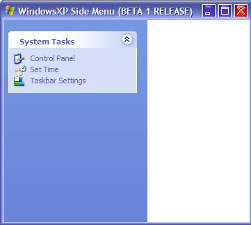



## WindowsXP SideMenu \(BETA 1 Release\)

### Description

I recently downloaded a code about XP side menu i thought that code was a bit difficult for begginers so I decied to do the same with simple code. This is just a BETA release and I have worked on it for 2 hours and now this beta is ready. If someone encourages me and suggests me some good Ideas I might make some good changes.

Hope u like it. any bugs? report at afaqmemon@hotmail.com
 
### More Info
 

             |
---                |---
**Submitted On**   |2002-05-18 01:33:56
**By**             |[Afaque Ahmed Memon](https://github.com/Planet-Source-Code/PSCIndex/blob/master/ByAuthor/afaque-ahmed-memon.md)
**Level**          |Beginner
**User Rating**    |4.2 (25 globes from 6 users)
**Compatibility**  |VB 6\.0
**Category**       |[Windows System Services](https://github.com/Planet-Source-Code/PSCIndex/blob/master/ByCategory/windows-system-services__1-35.md)
**World**          |[Visual Basic](https://github.com/Planet-Source-Code/PSCIndex/blob/master/ByWorld/visual-basic.md)
**Archive File**   |[WindowsXP\_843905172002\.zip](https://github.com/Planet-Source-Code/afaque-ahmed-memon-windowsxp-sidemenu-beta-1-release__1-34898/archive/master.zip)

